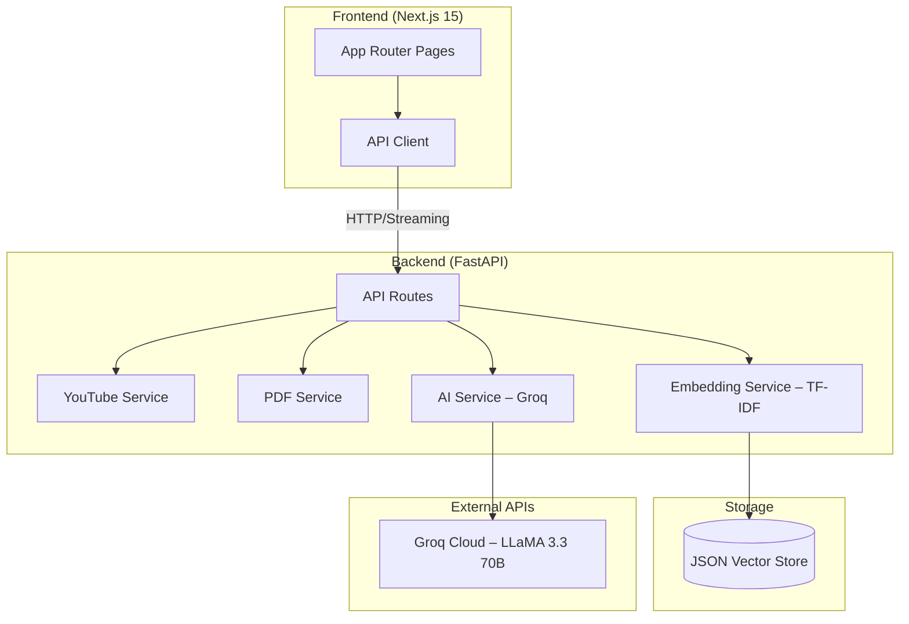

# 🤖 AI Learning Assistant

An AI-powered Learning Assistant where users can input a YouTube URL or upload a PDF. The system processes the content and generates flashcards, quizzes, and allows contextual chat using RAG (Retrieval-Augmented Generation).

> **Live Project** — [github.com/nikhildhankhar124106/LearnAI](https://github.com/nikhildhankhar124106/LearnAI)

## 🏗 Architecture



### Data Flow

1. **Content Ingestion** → User provides YouTube URL or uploads PDF
2. **Text Extraction** → Transcript or PDF text is extracted
3. **Chunking** → Text is split using `RecursiveCharacterTextSplitter` (1000 chars, 200 overlap)
4. **Storage** → Chunks stored in a lightweight JSON-based vector store (no external DB required)
5. **Retrieval** → TF-IDF vectorizer + cosine similarity used to retrieve top-k relevant chunks at query time
6. **Generation** → Groq (LLaMA 3.3 70B) generates flashcards/quizzes from stored chunks
7. **RAG Chat** → User queries matched via TF-IDF → top-k chunks retrieved → Groq streams a contextual response

## 🛠 Tech Stack

| Layer | Technology |
|-------|-----------|
| Frontend | Next.js 15 (App Router, TypeScript, React 19) |
| UI Styling | TailwindCSS 4 |
| Backend | Python FastAPI |
| Vector Store | In-memory TF-IDF + JSON persistence |
| AI Model | Groq — LLaMA 3.3 70B Versatile |
| Embeddings | scikit-learn TF-IDF (local, no API calls) |
| YouTube | youtube-transcript-api |
| PDF | PyPDF2 |
| Text Splitting | LangChain `RecursiveCharacterTextSplitter` |

## 📡 API Endpoints

| Method | Endpoint | Description |
|--------|----------|-------------|
| `POST` | `/process-video` | Process YouTube video transcript |
| `POST` | `/process-pdf` | Process uploaded PDF document |
| `POST` | `/generate-flashcards` | Generate 10-15 flashcards |
| `POST` | `/generate-quiz` | Generate 5-10 MCQ questions |
| `POST` | `/chat` | RAG-based chat (streaming) |
| `GET` | `/health` | Health check |
| `GET` | `/` | Root — API info & available endpoints |
| `GET` | `/docs` | Swagger API documentation |

## 🚀 Setup Instructions

### Prerequisites

- **Node.js** 18+ and npm
- **Python** 3.10+
- **Groq API Key** (free at [console.groq.com](https://console.groq.com))

### 1. Clone the Repository

```bash
git clone https://github.com/nikhildhankhar124106/LearnAI.git
cd LearnAI
```

### 2. Backend Setup

```bash
cd backend

# Create virtual environment
python -m venv venv

# Activate (Windows)
venv\Scripts\activate
# Activate (macOS/Linux)
# source venv/bin/activate

# Install dependencies
pip install -r requirements.txt

# Create .env file
copy .env.example .env
# Edit .env and add your GROQ_API_KEY

# Start the server
uvicorn main:app --reload --port 8000
```

The backend will be available at `http://localhost:8000` with Swagger docs at `http://localhost:8000/docs`.

### 3. Frontend Setup

```bash
cd frontend

# Install dependencies
npm install

# Start the dev server
npm run dev
```

The frontend will be available at `http://localhost:3000`.

### Environment Variables

#### Backend (`backend/.env`)
```
GROQ_API_KEY=your_key_here                    # Required
GROQ_MODEL=llama-3.3-70b-versatile            # Optional (default shown)
CHROMA_PERSIST_DIR=./chroma_data              # Optional – JSON store path
CHUNK_SIZE=1000                               # Optional
CHUNK_OVERLAP=200                             # Optional
RAG_TOP_K=5                                   # Optional
FRONTEND_URL=http://localhost:3000            # Optional
```

#### Frontend (`frontend/.env.local`)
```
NEXT_PUBLIC_API_URL=http://localhost:8000
```

## ☁️ Deployment

The project includes deployment configuration for multiple platforms:

| File | Purpose |
|------|---------|
| `backend/Procfile` | Heroku / Render — runs `uvicorn` on `$PORT` |
| `backend/vercel.json` | Vercel serverless deployment config |
| `backend/api/index.py` | Vercel entry point — re-exports the FastAPI app |
| `backend/build.sh` | Build script for cloud platforms |
| `backend/runtime.txt` | Specifies Python 3.11.11 |

## 📸 Features

### 🏠 Home Page
- YouTube URL input with instant processing
- PDF drag-and-drop upload zone
- Processing status with content preview

### 🎴 Flashcards
- 3D flip card animation
- Keyboard navigation (Arrow keys, Space/Enter to flip)
- Progress bar and dot indicators

### 📝 Quiz
- 5-10 multiple-choice questions
- Visual option selection with A/B/C/D labels
- Animated score circle with percentage
- Per-question explanations after submission
- Retry functionality

### 💬 AI Chat
- RAG-based contextual responses
- Streaming response with typing indicator
- Markdown rendering for formatted answers
- Chat history maintained per session
- Suggestion chips for common queries

## 📁 Project Structure

```
LearnAI/
├── backend/
│   ├── main.py                 # FastAPI app entry point
│   ├── config.py               # Environment configuration
│   ├── requirements.txt        # Python dependencies
│   ├── .env.example            # Environment template
│   ├── Procfile                # Heroku/Render deployment
│   ├── vercel.json             # Vercel deployment config
│   ├── build.sh                # Cloud build script
│   ├── runtime.txt             # Python version spec
│   ├── api/
│   │   └── index.py            # Vercel serverless entry point
│   ├── routes/
│   │   ├── process.py          # /process-video, /process-pdf
│   │   ├── generate.py         # /generate-flashcards, /generate-quiz
│   │   └── chat.py             # /chat (streaming)
│   └── services/
│       ├── youtube_service.py  # YouTube transcript extraction
│       ├── pdf_service.py      # PDF text extraction
│       ├── embedding_service.py# TF-IDF chunking & retrieval
│       └── ai_service.py       # Groq AI (flashcards, quiz, chat)
├── frontend/
│   ├── src/
│   │   ├── app/
│   │   │   ├── layout.tsx      # Root layout with sidebar
│   │   │   ├── page.tsx        # Home page
│   │   │   ├── globals.css     # Design system
│   │   │   ├── flashcards/page.tsx
│   │   │   ├── quiz/page.tsx
│   │   │   └── chat/page.tsx
│   │   ├── components/
│   │   │   └── Sidebar.tsx     # Responsive navigation
│   │   └── lib/
│   │       └── api.ts          # Backend API client
│   └── package.json
├── .gitignore
└── README.md
```

## 🧪 Error Handling

- **YouTube**: Invalid URL detection, missing transcript fallback, rate limit handling
- **PDF**: File type validation, size limit (10 MB), empty/scanned PDF detection
- **AI Generation**: JSON parsing with fallback extraction, response validation, automatic retry with exponential back-off on Groq 429 rate limits
- **Chat**: Stream error recovery, empty context handling
- **Frontend**: Loading states, error messages, disabled states during processing

## 📄 License

MIT
